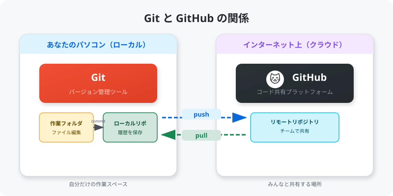

# GitHub-Studie

**Git / GitHub をチームで使えるようになるためのハンズオンガイド**

このリポジトリをフォークして、実際に手を動かしながら Git と GitHub の基本を学びましょう。

---

## このガイドについて

- 対象: Git / GitHub を初めて使う方、またはもっと慣れたい方
- 所要時間: 約 1〜2 時間
- 前提知識: ターミナル（コマンドプロンプト）の基本操作ができること

---

## 全体の流れ

```
1. 環境セットアップ     → Git のインストールと初期設定
2. Fork & Clone         → このリポジトリを自分のものにする
3. ブランチを切る       → 安全に作業するための準備
4. ファイルを編集する   → 自己紹介カードを作成
5. Commit & Push        → 変更を記録して GitHub に送る
6. Pull Request         → 変更をチームに提案する
7. レビュー & マージ    → コードを確認して統合する
```

---

## 良い勉強方法

**自分でまとめて、誰かにアウトプットするとよりよく覚えられます。**

このガイドを読むだけでなく、実際に手を動かしてみてください。
そして学んだことを自分の言葉で誰かに教えてみましょう。
「人に説明できる」レベルになれば、しっかり身についた証拠です。

このハンズオンでは、自己紹介カードを作って Pull Request を出すところまでが演習です。
一連の流れを体験すれば、次からは自信を持って Git / GitHub を使えるようになります。

---

## Git と GitHub の違い

Git と GitHub は名前が似ていますが、**まったく別のもの** です。

<p align="center">
  
</p>

| | Git | GitHub |
|---|---|---|
| **何？** | バージョン管理ツール | コード共有サービス |
| **どこで動く？** | 自分の PC（ローカル） | インターネット上（クラウド） |
| **役割** | ファイルの変更履歴を記録 | 記録した履歴をチームで共有 |

### Git はフォルダ全体を記録している

Git はファイルの「差分」だけでなく、**コミットするたびにフォルダ全体の状態をまるごと記録** しています。
だから「あの時の状態に戻したい」というとき、いつでも過去のコミットの状態に復元できます。

<p align="center">
  
</p>

### commit と push の違い

ここが一番混乱しやすいポイントです。VS Code で作業するイメージで見てみましょう:

<p align="center">
  
</p>

| コマンド | やっていること | どこの操作？ |
|----------|---------------|-------------|
| `git add` | 「この変更をコミットに含めます」と選択 | PC 上（Git） |
| `git commit` | 変更を履歴として **PC に保存** | PC 上（Git） |
| `git push` | 保存した履歴を **GitHub にアップロード** | GitHub に送信 |

> **つまり**: `commit` しただけでは自分の PC に記録されるだけで、まだ誰にも見えません。
> `push` して初めて GitHub 上にアップされ、チームメンバーが見られるようになります。

### VS Code のボタン = ターミナルのコマンド

VS Code を使っている場合、ターミナルでコマンドを打たなくてもボタン操作で同じことができます。

<p align="center">
  
</p>

| 操作 | VS Code のボタン | ターミナルのコマンド |
|------|-----------------|-------------------|
| ステージング | ファイル横の **「+」ボタン** | `git add ファイル名` |
| コミット | メッセージ入力 → **「Commit」ボタン** | `git commit -m "メッセージ"` |
| プッシュ | **「... → Push」** または **「Sync Changes」** | `git push origin ブランチ名` |

ボタンでもコマンドでも、裏で動いているのは同じ Git の仕組みです。
最初はボタンの方がわかりやすいかもしれませんが、慣れてくるとコマンドの方が速くて便利になります。

### 用語まとめ

| 用語 | 説明 |
|------|------|
| **Git** | ファイルの変更履歴を管理するツール。自分の PC で動く |
| **GitHub** | Git のデータをインターネット上で共有するサービス |
| **リポジトリ** | プロジェクトのファイルと履歴をまとめた箱 |
| **コミット (commit)** | 変更を自分の PC に記録する操作（Git の操作） |
| **プッシュ (push)** | コミットした記録を GitHub にアップロードする操作 |
| **ブランチ** | 本番に影響を与えずに作業するための分岐 |
| **Pull Request** | 「この変更を取り込んでください」という提案 |

---

## ガイド目次

| # | タイトル | 内容 |
|---|---------|------|
| 01 | [環境セットアップ](docs/01-setup.md) | Git のインストール・初期設定 |
| 02 | [Fork と Clone](docs/02-fork-and-clone.md) | リポジトリのフォークとクローン |
| 03 | [ブランチを切る](docs/03-branch.md) | ブランチの作成と切り替え |
| 04 | [ファイルを編集する](docs/04-edit.md) | 自己紹介カードを作ってみよう |
| 05 | [Commit と Push](docs/05-commit-and-push.md) | 変更を記録して GitHub に送る |
| 06 | [Pull Request を作る](docs/06-pull-request.md) | 変更をチームに提案する |
| 07 | [レビューとマージ](docs/07-review-and-merge.md) | コードレビューの流れ |
| 08 | [コンフリクトの解消](docs/08-conflict.md) | 衝突が起きたときの対処法 |
| 09 | [よく使うコマンド集](docs/09-cheatsheet.md) | 困ったときに見返す一覧 |
| 10 | [認証の設定（PAT / SSH）](docs/10-authentication.md) | push で弾かれるときの対処 |
| 11 | [困ったときは（トラブル集）](docs/11-troubleshooting.md) | エラー別の対処・リカバリー |

---

## 演習: 自己紹介カードを追加しよう

このリポジトリには `exercises/participants/` というフォルダがあります。
ここに自分の自己紹介カードを追加するのが今回の演習です。

**完成イメージ** → [サンプルカード](exercises/participants/example-taro.md)

### 手順の概要

1. このリポジトリを **Fork** する
2. フォークしたリポジトリを **Clone** する
3. `feature/add-自分の名前` ブランチを作る
4. `exercises/participants/` に自分の `.md` ファイルを作る
5. **Commit** して **Push** する
6. **Pull Request** を作成する

詳しい手順は [ガイド目次](#ガイド目次) の各ページで説明しています。

---

## 困ったときは

- [よく使うコマンド集](docs/09-cheatsheet.md) を見る
- チームメンバーに聞く（質問は大歓迎です！）
- [GitHub 公式ドキュメント](https://docs.github.com/ja)

---

## フォルダ構成

```
GitHub-Studie/
├── README.md                 ← このファイル（ガイドの入口）
├── CONTRIBUTING.md           ← コントリビューション手順
├── docs/                     ← 各章のガイド
│   ├── 01-setup.md
│   ├── 02-fork-and-clone.md
│   ├── ...
│   └── 09-cheatsheet.md
├── images/                   ← 図解用の画像
├── exercises/                ← ハンズオン演習
│   └── participants/         ← 自己紹介カード置き場
└── .github/                  ← PR テンプレートなど
```
