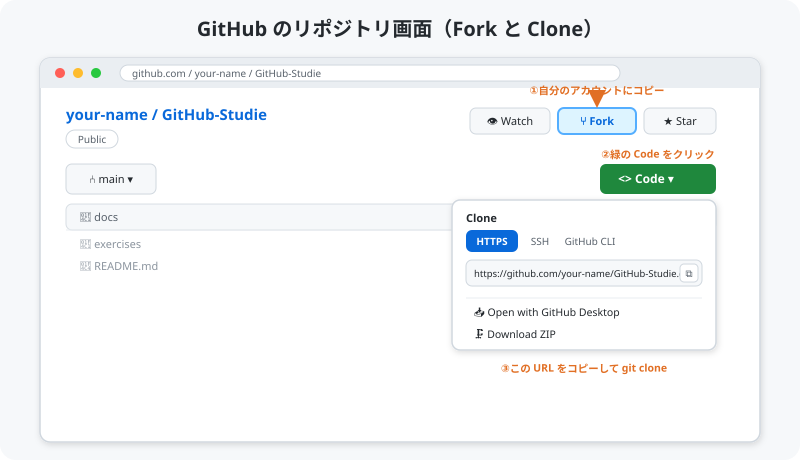

# 02. Fork と Clone

[< 前へ: 環境セットアップ](01-setup.md) | [目次](../README.md) | [次へ: ブランチを切る >](03-branch.md)

---

## この章でやること

- Fork（フォーク）の仕組みを理解する
- このリポジトリを Fork する
- Fork したリポジトリを自分の PC に Clone する

---

## Fork とは？

Fork とは、他の人のリポジトリを **自分のアカウントにコピー** することです。

コピーなので、自分のフォークをどれだけ変更しても元のリポジトリには影響しません。
安心して自由に編集できます。

<p align="center">
  
</p>

---

## 1. このリポジトリを Fork する

### 手順

1. [このリポジトリのページ](https://github.com/Akasan-T/GitHub-Studie) を開く
2. ページ右上の **「Fork」** ボタンをクリック
3. 「Create fork」をクリック

<p align="center">
  
</p>

> 上の図の **①Fork**（右上）でリポジトリを自分のアカウントにコピー、
> **②Code → ③Clone URL** をコピーして、次の手順の `git clone` に使います。

### 確認

Fork が完了すると、`https://github.com/あなたのユーザー名/GitHub-Studie` というページに移動します。

左上のリポジトリ名が **あなたのユーザー名/GitHub-Studie** になっていれば成功です。

> **ポイント**: 「forked from Akasan-T/GitHub-Studie」という表示が出ていることも確認しましょう。

---

## 2. Fork したリポジトリを Clone する

Clone とは、GitHub 上のリポジトリを **自分の PC にダウンロード** することです。

### 手順

1. **自分のフォーク**のページを開く（`https://github.com/あなたのユーザー名/GitHub-Studie`）
2. 緑色の **「Code」** ボタンをクリック
3. **HTTPS** タブの URL をコピー（上の図の ③ の部分です）

4. ターミナルを開いて、作業したいフォルダに移動:

```bash
cd ~/Desktop
```

5. 以下のコマンドを実行（URL は自分のものに置き換えてください）:

```bash
git clone https://github.com/あなたのユーザー名/GitHub-Studie.git
```

6. クローンしたフォルダに移動:

```bash
cd GitHub-Studie
```

### 確認

```bash
ls
```

`README.md` や `docs/` フォルダが表示されれば成功です。

---

## Clone した後の状態を確認しよう

```bash
git remote -v
```

以下のように表示されるはずです:

```
origin  https://github.com/あなたのユーザー名/GitHub-Studie.git (fetch)
origin  https://github.com/あなたのユーザー名/GitHub-Studie.git (push)
```

**origin** は「このリポジトリのリモート（GitHub上）の場所」を指します。

---

## よくあるトラブル

### 「git clone が遅い / 止まる」

ネットワーク環境を確認してください。社内プロキシがある場合は設定が必要なことがあります。

### 「Permission denied」

- HTTPS の場合: GitHub のユーザー名とパスワード（またはトークン）を確認
- Clone する URL が **自分のフォークの URL** であることを確認

---

## チェックポイント

- [ ] 自分のアカウントに GitHub-Studie のフォークがある
- [ ] `git clone` でローカルにダウンロードできた
- [ ] `git remote -v` で origin の URL が自分のフォークを指している

---

[< 前へ: 環境セットアップ](01-setup.md) | [目次](../README.md) | [次へ: ブランチを切る >](03-branch.md)
