# 03. ブランチを切る

[< 前へ: Fork と Clone](02-fork-and-clone.md) | [目次](../README.md) | [次へ: ファイルを編集する >](04-edit.md)

---

## この章でやること

- ブランチの仕組みを理解する
- 新しいブランチを作成する
- ブランチを切り替える

---

## ブランチとは？

ブランチは、**本番のコード（main ブランチ）に影響を与えずに作業するための仕組み**です。

<p align="center">
  
</p>

### 身近な例で考えると

ノートの「本番ページ」に直接書くのではなく、まず「下書きページ」に書いて、うまくいったら本番ページに清書する、というイメージです。

---

## 1. 現在のブランチを確認する

```bash
git branch
```

以下のように表示されます:

```
* main
```

`*` がついているのが、今いるブランチです。最初は `main` ブランチにいます。

---

## 2. 新しいブランチを作成する

自己紹介カードを追加するためのブランチを作ります。

```bash
git checkout -b feature/add-自分の名前
```

**例:**

```bash
git checkout -b feature/add-taro-yamada
```

> **`checkout -b` の意味**: 「新しいブランチを作成して（`-b`）、そのブランチに切り替える（`checkout`）」という意味です。

### 確認

```bash
git branch
```

```
  main
* feature/add-taro-yamada
```

`*` が新しいブランチに移っていれば成功です。

---

## ブランチ名の付け方

チーム開発では、ブランチ名に規則を設けることが多いです。

| 接頭辞 | 用途 | 例 |
|--------|------|----|
| `feature/` | 新機能の追加 | `feature/add-login` |
| `fix/` | バグの修正 | `fix/typo-in-readme` |
| `update/` | 既存機能の更新 | `update/profile-format` |

今回は **`feature/add-自分の名前`** を使いましょう。

---

## ブランチの切り替え

別のブランチに移動するには `git checkout` を使います:

```bash
# main ブランチに戻る
git checkout main

# 自分のブランチに戻る
git checkout feature/add-taro-yamada
```

> **注意**: ブランチを切り替える前に、今のブランチの変更をコミットしておきましょう。
> コミットしていない変更があると、切り替え時に問題が起きることがあります。

---

## よくあるトラブル

### 「error: Your local changes would be overwritten」

ブランチを切り替える前に、変更をコミットするか、一時退避（stash）してください:

```bash
# 一時退避する
git stash

# ブランチ切り替え後に元に戻す
git stash pop
```

---

## チェックポイント

- [ ] `git checkout -b feature/add-自分の名前` で新しいブランチを作成できた
- [ ] `git branch` で `*` が新しいブランチについている

---

[< 前へ: Fork と Clone](02-fork-and-clone.md) | [目次](../README.md) | [次へ: ファイルを編集する >](04-edit.md)
