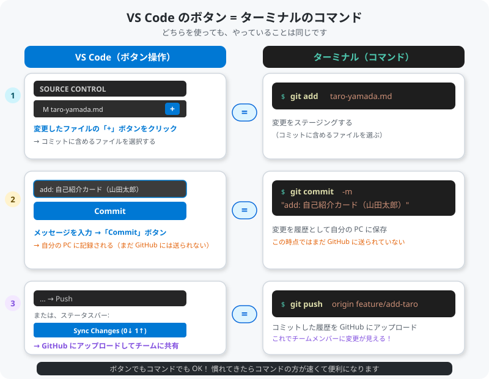

# 05. Commit と Push

[< 前へ: ファイルを編集する](04-edit.md) | [目次](../README.md) | [次へ: Pull Request を作る >](06-pull-request.md)

---

## この章でやること

- 変更をステージングする（git add）
- コミットする（git commit）
- GitHub に送る（git push）

---

## Git の基本操作フロー

<p align="center">
  
</p>

**編集 → git add → git commit → git push** が基本の流れです。

### commit と push の違い（重要）

<p align="center">
  
</p>

| コマンド | どこの操作？ | 何が起きる？ |
|----------|-------------|-------------|
| `git commit` | **自分の PC（Git）** | 変更が PC 上に記録されるだけ。まだ誰にも見えない |
| `git push` | **GitHub に送信** | PC の記録が GitHub にアップされ、チームが見られるようになる |

> commit = 自分用のセーブ、push = みんなに共有、と覚えましょう。

---

## 1. ステージングする（git add）

「この変更をコミットに含めますよ」と Git に伝える操作です。

```bash
git add exercises/participants/自分の名前.md
```

**例:**

```bash
git add exercises/participants/taro-yamada.md
```

### 確認

```bash
git status
```

```
On branch feature/add-taro-yamada
Changes to be committed:
  (use "git restore --staged <file>..." to unstage)
        new file:   exercises/participants/taro-yamada.md
```

**Changes to be committed** に表示されていれば、ステージング成功です。

> **ステージングって何のため？**
> 複数のファイルを変更したとき、「今回コミットしたいファイル」だけを選んでコミットできる仕組みです。
> 今回はファイル1つなので、あまり恩恵を感じないかもしれませんが、チーム開発では重要な機能です。

---

## 2. コミットする（git commit）

ステージングした変更を「履歴として記録」します。

```bash
git commit -m "add: 自己紹介カード（自分の名前）"
```

**例:**

```bash
git commit -m "add: 自己紹介カード（山田太郎）"
```

> **`-m` の意味**: コミットメッセージ（この変更の説明）を指定するオプションです。

### コミットメッセージのコツ

```
良い例:
  add: 自己紹介カード（山田太郎）
  fix: READMEのリンク切れを修正
  update: プロフィール画像を変更

悪い例:
  修正
  変更しました
  aaa
```

**何を変更したか** が一目でわかるメッセージを書きましょう。

---

## 3. GitHub に送る（git push）

ローカル（PC上）のコミットを、GitHub（リモート）にアップロードします。

```bash
git push origin feature/add-自分の名前
```

**例:**

```bash
git push origin feature/add-taro-yamada
```

### 初回の push で認証を求められた場合

GitHub のユーザー名とパスワード（Personal Access Token）を入力してください。

> **Personal Access Token の作り方**:
> GitHub → Settings → Developer settings → Personal access tokens → Generate new token
> 権限は `repo` にチェックを入れてください。

---

## 4. 確認

push が成功したら、ブラウザで自分のフォークのページを開いてみましょう:

`https://github.com/あなたのユーザー名/GitHub-Studie`

ブランチを `feature/add-自分の名前` に切り替えると、追加したファイルが表示されるはずです。

---

## VS Code のボタンでやる場合

ターミナルでコマンドを打たなくても、VS Code のボタンで同じ操作ができます。

<p align="center">
  
</p>

| 手順 | VS Code の操作 | 対応するコマンド |
|------|---------------|----------------|
| 1. ステージング | 左サイドバーのソース管理を開き、ファイル横の **「+」** をクリック | `git add ファイル名` |
| 2. コミット | 上部のテキスト欄にメッセージを書いて **「Commit」** をクリック | `git commit -m "メッセージ"` |
| 3. プッシュ | 上部の **「...」→「Push」** またはステータスバーの **「Sync Changes」** をクリック | `git push origin ブランチ名` |

> ボタンを押しても、裏で動いているのは同じ Git のコマンドです。
> 「ボタン派」でも「コマンド派」でも結果は同じなので、自分がやりやすい方を使ってください。

---

## 操作のまとめ（コマンド版）

```bash
# 1. 変更をステージング
git add exercises/participants/自分の名前.md

# 2. コミット（自分の PC に記録）
git commit -m "add: 自己紹介カード（自分の名前）"

# 3. GitHub に送る（ここで初めてチームに共有される）
git push origin feature/add-自分の名前
```

---

## よくあるトラブル

### 「Everything up-to-date」と表示されて push できない

コミットを忘れていませんか？ `git status` で確認してください。

### 「error: failed to push some refs」

他の人が先に変更を push している場合に起きます。以下を試してください:

```bash
git pull origin feature/add-自分の名前
git push origin feature/add-自分の名前
```

---

## チェックポイント

- [ ] `git add` でファイルをステージングした
- [ ] `git commit -m "メッセージ"` でコミットした
- [ ] `git push origin ブランチ名` で GitHub に送った
- [ ] ブラウザでフォーク先に自分のファイルが表示されている

---

[< 前へ: ファイルを編集する](04-edit.md) | [目次](../README.md) | [次へ: Pull Request を作る >](06-pull-request.md)
