# 06. Pull Request を作る

[< 前へ: Commit と Push](05-commit-and-push.md) | [目次](../README.md) | [次へ: レビューとマージ >](07-review-and-merge.md)

---

## この章でやること

- Pull Request（PR）の仕組みを理解する
- GitHub 上で PR を作成する
- 良い PR の書き方を学ぶ

---

## Pull Request とは？

Pull Request は、**「自分の変更を元のリポジトリに取り込んでください」** という提案です。

略して **PR**（ピーアール）と呼ばれることが多いです。

<p align="center">
  
</p>

---

## 1. PR を作成する

### 方法 A: GitHub が自動で提案してくれる場合

push した直後にフォーク先のページを開くと、黄色いバーで **「Compare & pull request」** が表示されることがあります。これをクリックすると簡単に PR を作成できます。

<!-- GIF: Compare & pull request ボタンが表示される様子 -->

### 方法 B: 手動で作成する場合

1. **元のリポジトリ**（`Akasan-T/GitHub-Studie`）のページを開く
2. **「Pull requests」** タブをクリック
3. **「New pull request」** をクリック
4. **「compare across forks」** をクリック
5. 以下を設定:
   - base repository: `Akasan-T/GitHub-Studie` / base: `main`
   - head repository: `あなた/GitHub-Studie` / compare: `feature/add-自分の名前`
6. **「Create pull request」** をクリック

<!-- GIF: PR を手動で作成する操作 -->

---

## 2. PR の内容を書く

PR にはテンプレートが用意されています。以下の項目を埋めてください:

### タイトル

```
add: 自己紹介カード（自分の名前）
```

### 本文

```markdown
## 変更内容

自己紹介カードを追加しました。

## 変更の理由

ハンズオン演習として自己紹介カードを作成しました。

## 確認したこと

- [x] ファイル名が正しい（`exercises/participants/自分の名前.md`）
- [x] 他の人のファイルを変更していない
- [x] 個人情報（電話番号・住所など）を含めていない
```

---

## 良い PR のポイント

| ポイント | 説明 |
|----------|------|
| **何を変更したか** | 変更の概要を簡潔に |
| **なぜ変更したか** | 目的や背景を書く |
| **どう確認したか** | 動作確認の方法やチェック項目 |

> **実際の開発では**: スクリーンショットや動作確認の手順を添付すると、レビュアーが確認しやすくなります。

---

## 3. PR を確認する

PR を作成したら、以下を確認しましょう:

- **Files changed** タブで、変更内容が正しいか
- 自分のファイルだけが変更されているか
- 余計なファイルが含まれていないか

---

## チェックポイント

- [ ] GitHub 上で Pull Request を作成できた
- [ ] PR のタイトルと本文を記入した
- [ ] Files changed で変更内容を確認した

---

[< 前へ: Commit と Push](05-commit-and-push.md) | [目次](../README.md) | [次へ: レビューとマージ >](07-review-and-merge.md)
