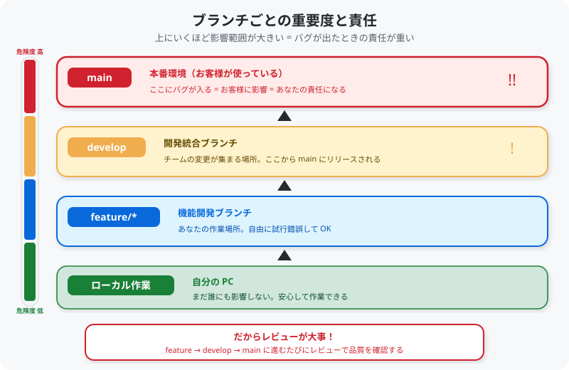

# 07. レビューとマージ

[< 前へ: Pull Request を作る](06-pull-request.md) | [目次](../README.md) | [次へ: コンフリクトの解消 >](08-conflict.md)

---

## この章でやること

- コードレビューの基本を理解する
- PR にコメントする方法を学ぶ
- マージの流れを知る

---

## コードレビューとは？

コードレビューは、**チームメンバーが書いたコードを他のメンバーが確認する** 作業です。

<p align="center">
  
</p>

### なぜレビューが必要？

- バグや問題を早期に発見できる
- コードの品質を一定に保てる
- チーム全体の知識共有になる
- 自分では気づかないミスに気づいてもらえる

---

## 1. 他の人の PR をレビューする

### PR を開く

1. リポジトリの **「Pull requests」** タブを開く
2. レビューしたい PR をクリック

### コードを確認する

1. **「Files changed」** タブをクリック
2. 変更された行が緑（追加）と赤（削除）で色分けされています

### コメントを残す

1. コメントしたい行の **左側にある「+」** ボタンをクリック
2. コメントを記入
3. **「Add single comment」** または **「Start a review」** をクリック

<!-- GIF: Files changed でコメントを残す操作 -->

### コメントの書き方

```
良い例:
  「ここの名前が途切れているかもしれません。確認してみてください」
  「Markdown のリスト記法、ここはハイフンの後にスペースが必要です」

避けたい例:
  「ダメ」
  「なんか違う」
```

**具体的に、やさしく** 書きましょう。

---

## 2. レビューを完了する

1. **「Review changes」** ボタンをクリック
2. 総合コメントを記入（任意）
3. 以下のいずれかを選択:
   - **Comment**: コメントのみ（承認でも却下でもない）
   - **Approve**: 承認（変更に問題なし）
   - **Request changes**: 修正を依頼
4. **「Submit review」** をクリック

---

## 3. マージする

レビューで承認されたら、変更を main ブランチに統合（マージ）します。

### 手順

1. PR のページで **「Merge pull request」** ボタンをクリック
2. **「Confirm merge」** をクリック

<!-- GIF: Merge pull request ボタンをクリックする操作 -->

> **今回のハンズオンでは**: 主催者がマージを行います。
> PR を作成したら、レビューをお待ちください。

---

## 4. マージ後の片付け

マージが完了したら、ローカルの main ブランチを最新にしましょう:

```bash
# main ブランチに切り替え
git checkout main

# 最新の変更を取得
git pull origin main
```

---

## レビューの責任 ― なぜ真剣にやるべきか

<p align="center">
  
</p>

### ブランチには「重さ」がある

| ブランチ | 影響範囲 | バグが入ったら？ |
|----------|---------|----------------|
| **main** | お客様が使う本番環境 | お客様に直接影響する。障害対応が必要 |
| **develop** | チーム全体の開発環境 | 他のメンバーの作業が止まる可能性がある |
| **feature/*** | 自分の作業スペース | 自分だけの影響。自由に試行錯誤 OK |

### レビューは「最後の砦」

feature ブランチで作った変更は、レビューを経て develop → main へと進んでいきます。
つまり **レビューは、バグが本番に入るのを防ぐ最後のチェックポイント** です。

レビューが甘いと何が起きるか:

1. バグがそのまま main にマージされる
2. 本番環境にデプロイされる
3. **お客様がそのバグに遭遇する**
4. 障害対応・修正・お詫び... → **あなたの責任になる**

レビューする側もされる側も、「本番で動いて大丈夫か？」という意識を持つことが大切です。

### 実務で気をつけること

- **「動いたから OK」ではない** ― 例外ケースや境界値も考える
- **わからないコードは質問する** ― 理解できないまま Approve しない
- **自分のコードも疑う** ― 「完璧」と思ったコードにもバグは潜んでいる
- **テストを確認する** ― テストが通っているか、テスト自体が正しいか

---

## レビューされる側のコツ

| コツ | 説明 |
|------|------|
| **小さな PR を出す** | 変更が少ないほどレビューしやすい |
| **説明をしっかり書く** | レビュアーの理解を助ける |
| **指摘を素直に受け入れる** | 学びのチャンス |

---

## チェックポイント

- [ ] 他の人の PR を1つ以上レビューした（コメントまたは Approve）
- [ ] 自分の PR がレビューされたらコメントに対応できる

---

[< 前へ: Pull Request を作る](06-pull-request.md) | [目次](../README.md) | [次へ: コンフリクトの解消 >](08-conflict.md)
