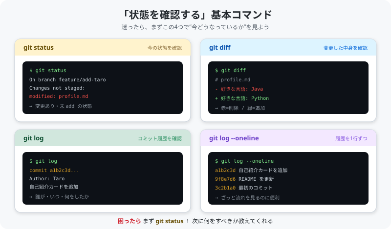

# 09. よく使うコマンド集

[< 前へ: コンフリクトの解消](08-conflict.md) | [目次](../README.md) | [次へ: 認証の設定 >](10-authentication.md)

---

困ったときに見返すための Git コマンドリファレンスです。

---

## 基本操作

この4つは「今どうなっているか」を確認するためのコマンドです。
実際の表示イメージを見てみましょう:

<p align="center">
  
</p>

| コマンド | 説明 |
|----------|------|
| `git status` | 現在の状態を確認 |
| `git log` | コミット履歴を表示 |
| `git log --oneline` | コミット履歴を1行ずつ表示 |
| `git diff` | 変更内容を確認 |

---

## ブランチ操作

| コマンド | 説明 |
|----------|------|
| `git branch` | ブランチ一覧を表示 |
| `git checkout -b ブランチ名` | 新しいブランチを作成して切り替え |
| `git checkout ブランチ名` | ブランチを切り替え |
| `git branch -d ブランチ名` | ブランチを削除 |

---

## 変更の記録

| コマンド | 説明 |
|----------|------|
| `git add ファイル名` | ファイルをステージング |
| `git add .` | すべての変更をステージング |
| `git commit -m "メッセージ"` | コミット |
| `git push origin ブランチ名` | GitHub に送る |

---

## リモート操作

| コマンド | 説明 |
|----------|------|
| `git clone URL` | リポジトリをダウンロード |
| `git pull origin ブランチ名` | 最新の変更を取得 |
| `git remote -v` | リモートの URL を確認 |

---

## 取り消し・修正

| コマンド | 説明 |
|----------|------|
| `git restore ファイル名` | 編集前の状態に戻す（未ステージング） |
| `git restore --staged ファイル名` | ステージングを取り消す |
| `git stash` | 変更を一時退避 |
| `git stash pop` | 一時退避した変更を元に戻す |

---

## よくあるエラーと対処法

### `fatal: not a git repository`

Git リポジトリの外にいます。`cd` でリポジトリのフォルダに移動してください。

```bash
cd GitHub-Studie
```

### `error: Your local changes would be overwritten`

未コミットの変更があります。コミットするか stash してください。

```bash
# 方法1: コミットする
git add .
git commit -m "一時保存"

# 方法2: 一時退避する
git stash
```

### `error: failed to push some refs`

リモートに自分が持っていない変更があります。pull してから push してください。

```bash
git pull origin ブランチ名
git push origin ブランチ名
```

### `Permission denied (publickey)`

認証に失敗しています。HTTPS で clone し直すか、SSH キーを設定してください。

```bash
# HTTPS で clone し直す場合
git remote set-url origin https://github.com/あなたの名前/GitHub-Studie.git
```

---

## 困ったときの万能コマンド

まず現在の状態を把握する:

```bash
git status
```

このコマンドが Git の状態と「次に何をすべきか」を教えてくれます。
迷ったらまず `git status` を実行しましょう。

エラーで詰まったときは → [11. 困ったときは（トラブル集）](11-troubleshooting.md)

---

[< 前へ: コンフリクトの解消](08-conflict.md) | [目次](../README.md) | [次へ: 認証の設定 >](10-authentication.md)
